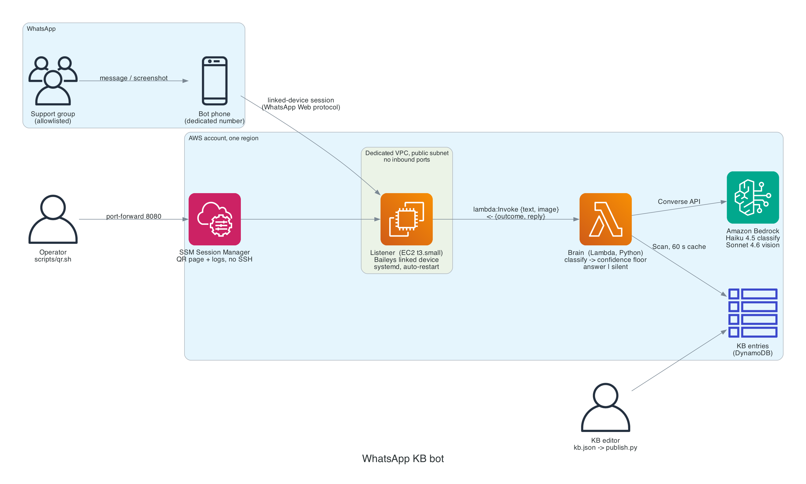

# WhatsApp KB bot

A WhatsApp bot that answers repeat questions in a support group from a **curated knowledge
base**, running entirely in your own AWS account. The model picks *which* answer applies;
by default it never writes one. What the group receives is text a human wrote, verbatim.
When nothing matches well enough, the bot stays silent.

Built from a bot that has been answering a 120-developer support group at a bank since
mid-2026. This repo is the generic, stripped-down template of that system.



**Read the article:** [How I built a WhatsApp bot that answers questions from a knowledge base on AWS](docs/article/ARTICLE.md)

## What you get

| Folder | What |
|---|---|
| `kb/` | `kb.json` is the knowledge base (8 sample entries to replace). `kbcheck.py` validates it, `publish.py` syncs it to DynamoDB |
| `brain/` | One Python Lambda. Reads the KB, asks Bedrock (Claude Haiku 4.5) which entry answers the message, applies a confidence floor, composes the reply. Optional screenshot reading with Claude Sonnet |
| `listener/` | Node.js service for an always-on EC2 box. Holds the WhatsApp session with [Baileys](https://github.com/WhiskeySockets/Baileys), forwards allowlisted group messages to the brain, sends the reply. Plus a self-refreshing QR page for linking |
| `infra/terraform/` | Everything above as Terraform: VPC, EC2, Lambda, DynamoDB, IAM |
| `infra/cloudformation/` | The same stack as one CloudFormation template plus a `deploy.sh` |
| `scripts/` | `ask.sh` (test the brain), `qr.sh` (link the phone), `logs.sh`, `shell.sh`, all over SSM, no SSH |
| `docs/` | The article, diagrams, design notes, and a survey of open-source alternatives |

**Cost:** about $18/month for the EC2 (t3.small, 24/7) plus a fraction of a cent per
message for Bedrock. Everything else is on-demand and rounds to zero at support-group volumes.

## Before you start: read this

- **This uses an unofficial WhatsApp client.** Baileys speaks the WhatsApp Web protocol as a
  linked device. That is against WhatsApp's terms of service, and numbers do get banned.
  The official Business Cloud API is the compliant route, but its Groups API caps groups at
  **8 participants** and cannot join a group a person created, so it cannot serve an
  existing community group. Use a **dedicated prepaid number**, never your own. Keep the bot
  reply-only, low volume, and in groups of people who know it is there.
  See `docs/DESIGN.md` and `docs/research/open-source-landscape.md`.
- **Silence is a feature.** In a group, a wrong answer costs more than no answer. The floor
  defaults to 0.85; the production bot runs at 0.90 after measuring that the 0.80–0.90 band
  was mostly wrong.
- **The KB is the product.** The code is a few hundred lines. Stale entries are the failure
  mode you will actually hit; every entry has a `last_verified` date for that reason.

## Quick start (Terraform)

Prerequisites: an AWS account with Bedrock model access enabled for Claude Haiku 4.5 (and
Sonnet 4.6 if you want screenshots) in your region, Terraform ≥ 1.5, Python 3, the AWS CLI
with the [Session Manager plugin](https://docs.aws.amazon.com/systems-manager/latest/userguide/session-manager-working-with-install-plugin.html).

```bash
git clone https://github.com/kobyal/whatsapp-kb-bot.git && cd whatsapp-kb-bot

# 1. Fork first, then point the instance at your fork (it clones the listener code at boot)
cd infra/terraform
cp terraform.tfvars.example terraform.tfvars      # set allowed_groups and repo_url
terraform init && terraform apply

# 2. Publish the knowledge base (edit kb/kb.json first)
cd ../.. && python3 kb/kbcheck.py && python3 kb/publish.py --table wakb-kb-entries

# 3. Test the brain with no WhatsApp involved
scripts/ask.sh wakb-brain "my vpn keeps disconnecting"

# 4. Link the bot phone: open http://localhost:8090 and scan from WhatsApp > Linked devices
scripts/qr.sh <instance-id>

# 5. Watch it work
scripts/logs.sh <instance-id>
```

`allowed_groups` takes group **subjects** (the name you see in WhatsApp) or jids. Everything
not on the list is logged with its jid and dropped, so if you are unsure of a name, send one
message and read it off `scripts/logs.sh`.

## Quick start (CloudFormation)

```bash
aws s3 mb s3://<your-deploy-bucket>
infra/cloudformation/deploy.sh wakb <your-deploy-bucket> \
  AllowedGroups="My Team Support" RepoUrl=https://github.com/<you>/whatsapp-kb-bot.git
```
Then steps 2–5 above.

## Day two

- **Edit the KB**: change `kb/kb.json`, run `kbcheck.py`, run `publish.py`. Live within a
  minute; no redeploy. The zip also carries a snapshot as a fallback if the table is unreachable.
- **Tune**: `min_confidence`, `answer_mode` (`verbatim` or `compose`), `bot_header`, the models.
  All are variables in both infra flavours and env vars on the Lambda.
- **Re-link**: if the phone unlinks the device (WhatsApp does this after 14 days without the
  phone online), the listener clears its auth and shows a new QR. Run `scripts/qr.sh` again.
- **Update the listener code**: `terraform apply` after changing `git_ref`, or on the box
  `sudo bash /opt/wakb/src/listener/install.sh`.

## How the brain decides

```
message ──► (image? read it into text with Sonnet) ──► classify with Haiku against the catalogue
        ──► id + confidence ──► below floor or "none": silent
                            ──► at or above floor: send the entry's answer (quoted reply, 1.5–4 s jitter)
```
The classifier prompt also asks whether the message is a request for help at all.
Announcements, "same here", and people answering each other return `none`. In production
this one rule removed half of the false positives.

## License

MIT. Use it, fork it, tell me what broke.
