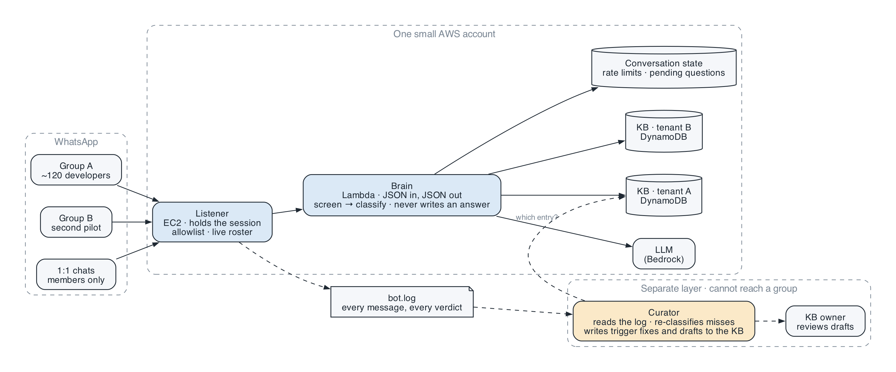
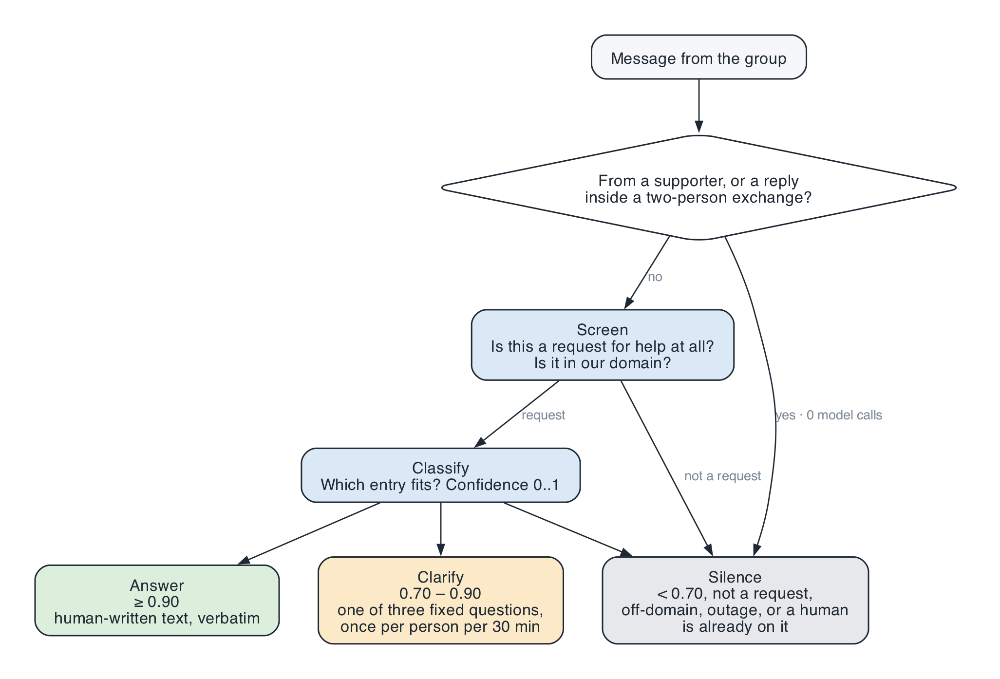
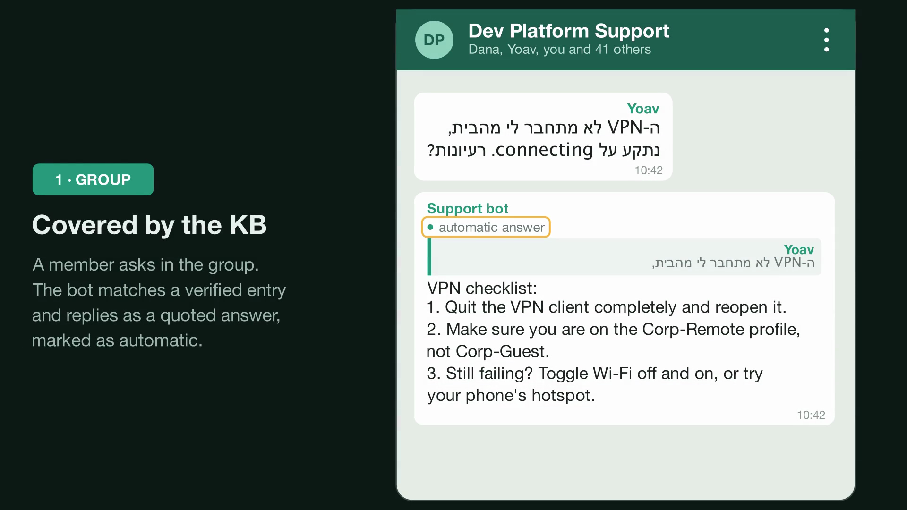
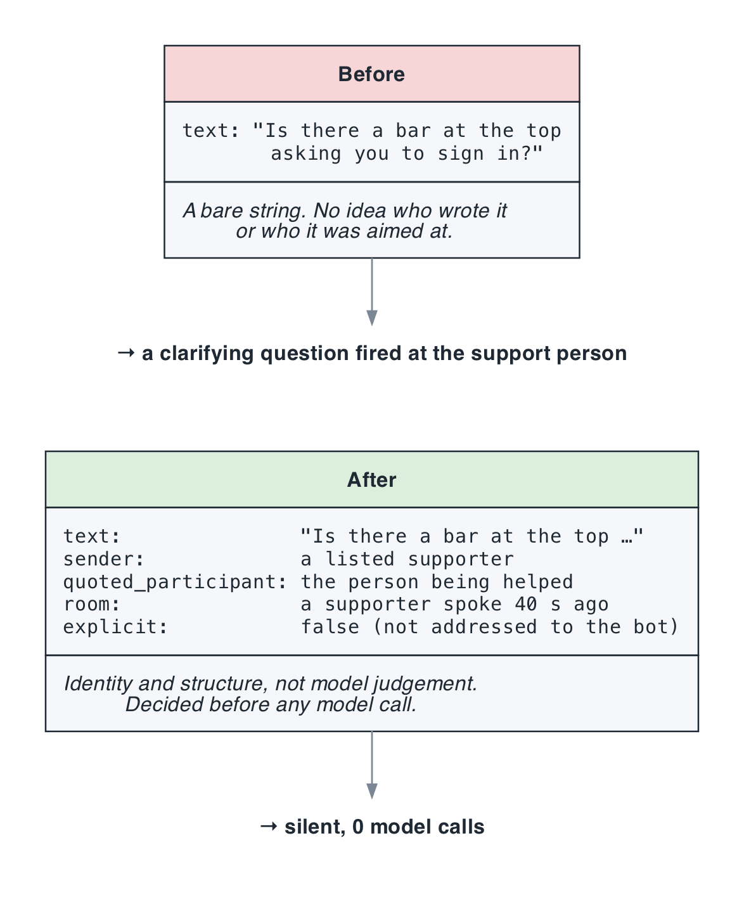
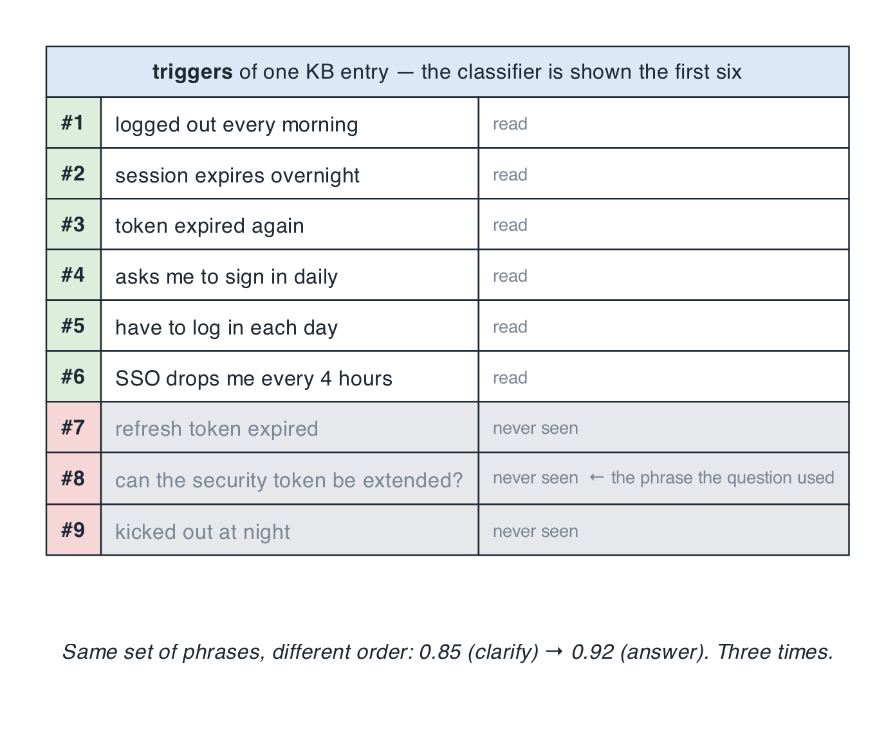
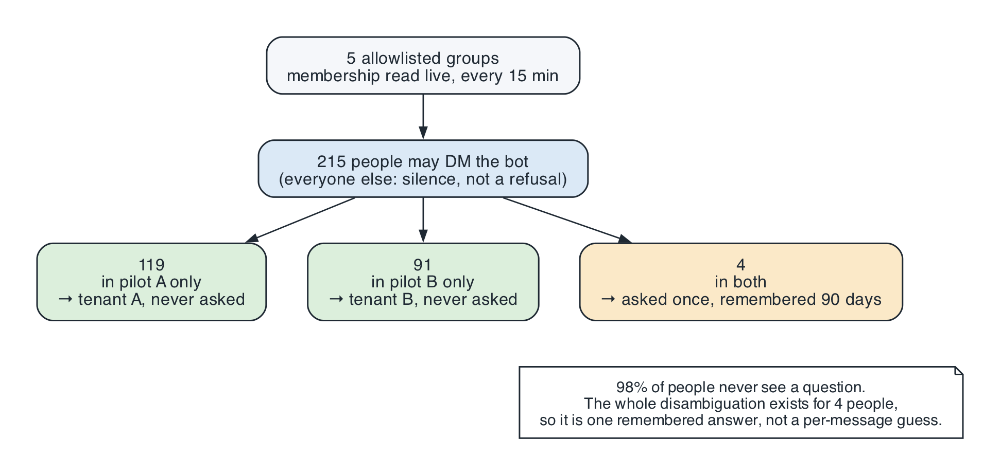
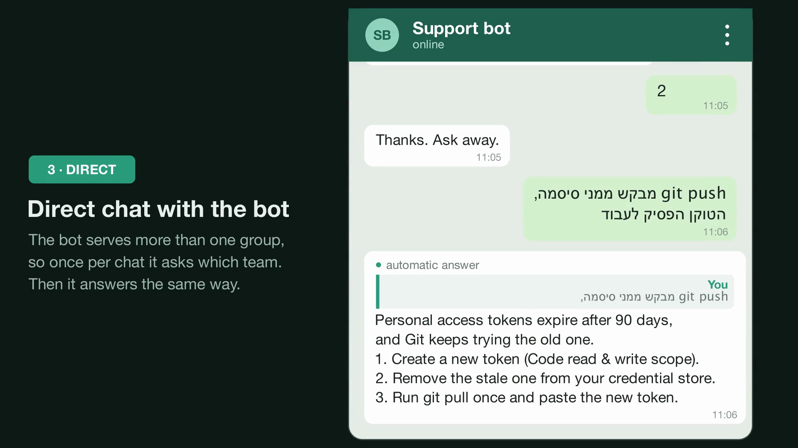
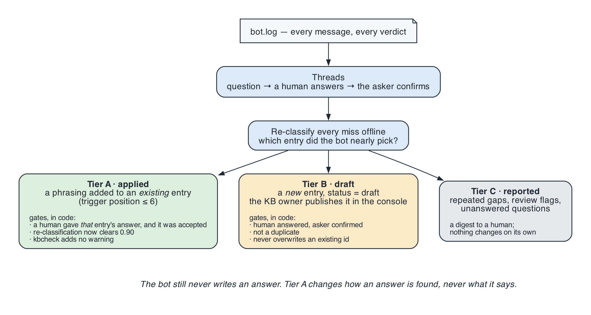
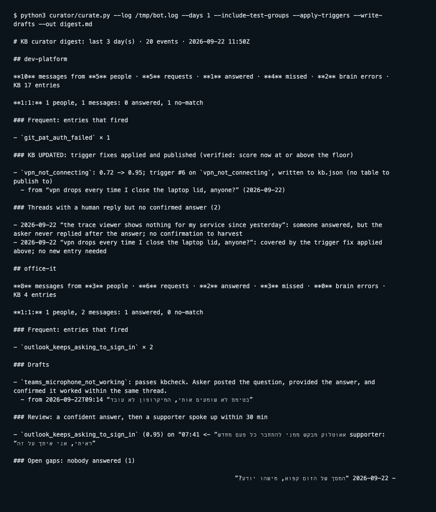
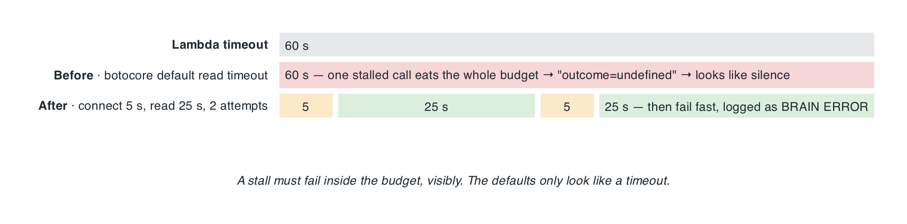

# I gave a WhatsApp support bot to 200 colleagues. Here is what it took to make it shut up, listen, and learn.

*A knowledge-base bot in two pilot groups at a bank, on EC2 + Lambda + Bedrock for about $18 a month. The model never writes an answer. The interesting part was everything it had to learn not to say.*

*Figure 1. One WhatsApp account, one listener, one brain, one knowledge base per group, and a curator that can only read the log.*

**TL;DR** A small EC2 instance holds the WhatsApp session. A Lambda asks a model *which* human-written answer fits and sends it word for word if confidence clears 0.90, asks one of three fixed questions between 0.70 and 0.90, and says nothing otherwise. It serves two pilot groups with separate knowledge bases, answers members in private chat, and a separate layer harvests confirmed answers from the log into the KB behind gates that run in code. Three months in, the lessons that mattered were about identity and structure, not prompts. Repo: [github.com/kobyal/whatsapp-kb-bot](https://github.com/kobyal/whatsapp-kb-bot).

*Personal project, my own time and my own AWS account. Not a product of my employer, not endorsed by WhatsApp, and it uses an unofficial WhatsApp client; section 1 explains what that means before you decide whether to run one.*

*A 34-second demo with fictional people and a generic chat UI. The mp4 is in `docs/article/demo/`.*

---

Every support group has the same twenty questions. "It logs me out every morning." "How do I install this on Windows?" Someone who knows the answer types it for the fifteenth time, or pastes a link nobody reads, or is asleep.

I run one of those groups: about 120 developers at a bank onboarding onto a new AI coding tool, all in one WhatsApp group. In the summer of 2026 I built a bot that sits in the group and answers the questions that repeat. In September a second division asked for one, for a different pilot with a different knowledge base. Then people started messaging the bot privately. Then, one morning after a holiday, I opened the second group and found the bot asking a clarifying question of the person who was doing the support.

This is the story of that bot growing from "answers a question" to "knows when to be quiet", and of the template version that is public. I will cover:

1. The two constraints that decide the architecture before you write a line
2. What the bot does, and why silence is one of its three outcomes
3. The morning it talked over the humans, and three fixes that were not prompt wording
4. Why the *order* of a list in a JSON file decided whether a question got answered
5. Two groups, one bot, and what happened when people wanted to DM it
6. The curator: letting the bot learn from the log without letting it write
7. A 60-second stall that looked exactly like silence
8. Costs, risks, what is next, and what I would do differently

## 1. Two constraints you cannot design around

### WhatsApp has no official way into a group

The WhatsApp Business Cloud API is the compliant route, and if your bot is a 1:1 customer-service line, use it. But if the bot needs to live *inside a group that already exists*, read the Groups API documentation: as of writing, a group created through the API is capped at **8 participants**, the business must create the group itself, and it cannot join a group a person created. Registering a number with the Cloud API also deletes that number's normal WhatsApp account. Meta's new setup-automation tooling, announced this month, changes none of those limits.

So for a community group of a hundred people, the only technical route is an **unofficial multi-device client**: a library that speaks the WhatsApp Web protocol and appears as a linked device, like WhatsApp Desktop does. I use [Baileys](https://github.com/WhiskeySockets/Baileys). It works well. It is also against WhatsApp's terms of service, and numbers running it do get banned.

I will not pretend otherwise, so here is how I live with it. A **dedicated prepaid SIM** in an old Android on Wi-Fi, never my own number. **Reply-only**: the bot never starts a conversation and never messages a stranger. **Human pacing**: a random 1.5 to 4 second delay before every reply. Nothing I care about attached to that number. If it is banned, I lose a cheap SIM; if it were my number, I would lose my chats, my groups and my family with no appeal process that works. People make that mistake exactly once, so the repo has a whole document on picking the SIM.

A linked device holds a persistent WebSocket and Lambda dies after 15 minutes, so the bot is two pieces: a tiny always-on **listener** on EC2 that knows nothing about the knowledge base, and a **brain** in Lambda that knows nothing about WhatsApp. JSON in, JSON out. Everything below happens in the brain, which is why almost none of it is WhatsApp-specific.

### The model routes. It does not write.

This is the rule I would defend hardest, and every feature in this article was built inside it. The bot sends a knowledge-base entry's `answer` exactly as a human wrote and verified it. The model's only job is to pick *which* entry.

In a group, a confident wrong answer is the most expensive thing a bot can do. Everyone reads it. It looks official. Someone follows it. Bounding the model to "pick an entry" bounds the failure to "wrong entry", and a confidence floor handles that. "Plausible invented steps" stops being a failure mode. Even the three clarifying questions are hard-coded strings; the model returns a *key*, and an unknown key falls back to the one asking for the exact error text.

## 2. What the bot does, and why silence is an outcome

*Figure 2. Three outcomes, and most paths lead to the grey one.*

**Screen first.** Before any matching, a short prompt with no catalogue in it answers one question: *is this a request for help at all, and is it in our domain?* When I replayed 326 real group messages through an early version, 21 of the 64 confident answers landed on messages that were never questions: someone posting a fix for others, a staff announcement, "same here", one human asking another. The bot was talking over the humans doing triage.

**Then classify.** The model sees a catalogue of every entry's id, phrasings, error strings and a short gloss, never the answers, and returns `{"id": ..., "confidence": 0.93}`.

**Then one of three outcomes.**

| Confidence | Outcome | Why the edge is where it is |
|---|---|---|
| ≥ 0.90 | **Answer**, verbatim | The model only emits 0.92 and 0.95 above this line; measured after the change, 0% of them were wrong |
| 0.70 – 0.90 | **Clarify**: one of three fixed questions, once per person per 30 minutes | The 0.85 bucket was right 3 times in 39. A bucket that names an entry and is wrong 92% of the time is exactly where one concrete question is the honest response |
| below 0.70, not a request, off-domain, or "is the service down?" | **Silence** | A knowledge base cannot answer "is it down for everyone?", and asking "which environment?" sets an expectation it cannot meet |

My first floor was 0.80. When an independent model graded every confident answer in the replay, the wrong-or-partial rate was **42%**. Raising the floor to 0.90 and routing the 0.85 bucket to a question took it to **6%**. The bot answered fewer, better questions, and in a 120-person group that is the trade you want every time.

Silence is not the bot failing. It is the bot deciding a human will do this better, which in a group full of humans is usually true. It is also *readable*: people learn that the bot speaks only when it is sure, which is the only reputation worth having.

The clarify rate limit is a safety property, not a nicety. WhatsApp delivers bursts, and the first real end-to-end run sent three identical clarifying questions within one second from concurrent invocations. Comparing "now" to a stored timestamp is not a rate limit under concurrency; the limit now lives in a DynamoDB conditional write, so exactly one caller can win it.

## 3. The morning the bot talked over the humans

The second pilot group has something the first does not: a staffed support bench, two people whose job is to answer. On the first morning back from a holiday, my bot interrupted both of them.

At 08:33 the division's product owner asked a user, "Is there a bar at the top of Outlook asking you to sign in?" The bot replied to *her* with a clarifying question. Ten minutes later her colleague, quoting a user, asked "drag it to the mail icon in the taskbar, or into the open window?" The bot asked *him* for the exact error text.

*From the demo: a covered question in the group. (The real thread from that morning is a bank group, so it stays out of this article.)*

Both are textbook "second person aimed at a human", and the screening prompt already had a rule for exactly that. It had been right for two weeks and still did not fire. The reason was not in the prompt.

*Figure 3. The prompt was fine. The input was a bare string.*

**The brain only ever saw the text.** The listener forwarded `{text, group, participant}`. Nothing about who the sender was in that room, whom they were replying to, or whether a human had just picked the question up. No prompt can recover information that was never in the input. So the three fixes are all **identity or structure, never model judgement**:

- **`supporters`, per tenant.** The people who *answer* in this group. Their messages return silent before the screen or the vision pass runs; the deployed function reports `calls=0` on that path. An explicit call to the bot is exempt, because a supporter may address it on purpose.
- **`quoted_participant`.** The listener now passes the author of the quoted message. A reply inside a two-person exchange **suppresses the question but not an answer**: a ≥0.90 hit is worth having whoever it was aimed at; only the guess is unwelcome.
- **A supporter-activity window.** One row per *group*, because "is a human already on this?" is a property of the room. 180 seconds, the observed gap between a question and one of the group's own answerers picking it up.

And one number that changed a default. Route 2, the clarifying question when the classifier finds *nothing* and the screen says the message is too vague, is a bet that the KB can answer once the message is sharpened. Measured in the second group over its first week, against an 8-entry knowledge base: **11 clarifying questions, 0 answers.** Every follow-up ended in silence because no answer existed to be found. The people who replied got nothing for replying. Route 2 is now a per-tenant flag: off for the small KB, on for the 41-entry one where the same trade was measured to pay. With a small KB the bet always loses, and the bot spends its credibility asking questions it cannot use.

## 4. Trigger order is load-bearing

This one cost me a correct answer three separate times before I drew the picture.

*Figure 4. The classifier is shown the first six phrasings of each entry. Position 8 does not exist as far as it knows.*

To keep the catalogue cacheable and the cost flat, each entry contributes its **first six** trigger phrasings to the prompt. A real question about extending a security token scored 0.85 against the right entry and got a clarifying question instead of the answer. The entry contained the exact phrase the user typed, at trigger **#8**. Moving it to #5, same set, positions only, took the score to 0.92, three runs out of three.

The regression gate caught it, not review. The lesson generalises: when you truncate a list to bound a prompt, the truncation is a product decision, and the tool that edits the list has to know about it. My KB checker now warns at position 7 or later, and the curator in section 6 may only add phrasings at positions ≤ 6.

## 5. Two groups, one bot, and then 1:1

When the second division asked for a bot, the obvious move was a second number: a second SIM, session, EC2 and linking ceremony, for nothing the users would see. Instead a **tenant** is a folder, `tenants/<id>/`, with a `tenant.json` (group ids, table, disclosure header, prompt audience text, the supporters list, the route-2 flag) and a `kb.json`. The brain resolves the tenant from the group id on every message. Shared: the account, the listener, the code, the floors. Per tenant: the KB, the texts, the policy flags. The first tenant's measured behaviour is pinned by tests, so adding a second cannot move it.

Then people started messaging the bot privately. Three had already tried, one with a screenshot, and been dropped in silence because the listener only accepted group messages. So: the same engine, reached directly, with three deltas.

*Figure 5. The disambiguation design exists for four people.*

**Authorisation is a live roster, not a list.** Every 15 minutes the listener rebuilds "who is in which pilot" from the groups' own membership, so someone removed from a group loses DM access at the next refresh with nobody maintaining a second list. A roster that builds *empty* is refused, because an empty map denies everybody and looks exactly like the feature being broken.

**A stranger gets silence, never a refusal.** "You are not authorised" would confirm to whoever is probing that this number is a support bot for a specific organisation. That is not theirs to learn.

**The tenant comes from the roster too.** Measured on the live groups: **215 people**, 119 in one pilot only, 91 in the other only, **4 in both**. So 98% of people are never asked anything. The four are asked once, "which pilot?", and the answer is remembered for 90 days. I nearly built per-message inference for this; the numbers said one remembered answer.

*From the demo: the one-time "which team?" question, then a normal answer.*

**A DM is treated as explicit.** Silence is a designed, readable answer in a 120-person group. In a private chat it is a bot ignoring you. So a DM carries the weight an @-mention already carries: the screen is skipped, and a no-match says so in a fixed sentence. The group-only suppressions from section 3 are all guarded on "not explicit", so they switch themselves off in a DM without a second flag. A supporter asking the bot privately is a person with a question.

The whole channel sits behind one environment variable, default off, because a private channel where 200 staff send screenshots is a different data-flow story from a bot in a group, and that story belongs in front of a security reviewer before the flag goes to 1.

## 6. The curator: learning from the log without writing

Feeding the knowledge base was me reading the group, finding the question a human answered and someone confirmed, writing the entry, ordering the triggers, running the checker, publishing. Two sessions a week of that is not a process. The second division's KB owner had the right expectation: when there is high-confidence new knowledge in the group, the KB should reflect it without a person having to notice.

My constraint: a different layer, integrated in no way that could jeopardise the running bot. That ruled out the brain writing events anywhere and pointed at something better: everything the curator needs is already in `bot.log`. It *pulls* the log, a read the bot cannot tell happened, and nothing on the operational path changed. A bug in the curator cannot reach a group, by construction.

*Figure 6. Only Tier A touches the KB without a click, and only where the answer text cannot change.*

The log carries every verdict but not the fact most useful for fixing a KB: on a miss, which entry the bot *nearly* picked. The curator recovers it by re-classifying every miss offline through the same brain module, one cheap call per miss. Then three tiers. **Tier A, applied**: a phrasing added to an *existing* entry, at position ≤ 6. **Tier B, draft**: a *new* entry with `status=draft`, which the KB owner publishes in the console they already use. **Tier C, reported**: repeated gaps, review flags and unanswered questions, in a digest to a human.

**The day-one lesson: matching is not correctness.** Tier A's first gate was "re-classifying the missed message against the modified entry clears 0.90." That proves a phrasing makes the entry *match*. It says nothing about whether the match is *right*. In the dry run the curator was about to teach the sign-in entry the phrasing "can't log in to Outlook", lifted from a thread that had actually resolved a drag-and-drop problem. The bot would then have given the sign-in answer, confidently, to every generic login complaint.

Worse, when I asked the model whether the thread confirmed the entry, it rationalised a confirmation that was not there. So the gate is now a separate, narrow judgement over the thread, *did a human give this entry's answer, and did the asker accept it?*, whose output is checked in code alongside the KB checker (a change may not *add* a warning), a duplicate check, and a rule that an id is never overwritten. In the live run it refused exactly that case, twice.

**Where a rule can be checked in code, check it in code.** The model is good at "does this thread look like a confirmation?" and bad at also deciding whether to act on it. Split the two.

Proven end to end in test groups: a phrasing the bot had only clarified at 09:11 was answered at 09:25 after Tier A wrote it (then reverted, because one person confirming in a test group is not evidence), and a seeded thread became a draft that was silent while draft, answered once published, silent again once deleted.

*A digest produced by the template's curator on its bundled example log — the real ones name internal entries, so they stay out of the article.*

## 7. The 60-second stall that looked like silence

While seeding those threads, a "got it, thanks!" message produced a Lambda **timeout at 60,000 ms**. The listener printed `outcome=undefined` and moved on, which in a group reads as the bot correctly staying quiet.

*Figure 7. The two defaults are equal, so one stalled call consumes the whole budget and fails invisibly.*

botocore's default read timeout is 60 seconds. My Lambda's timeout was 60 seconds. One stalled model call ate the entire budget and surfaced as an absence. The client is now bounded (connect 5 s, read 25 s, two attempts), a stall fails fast into the existing fail-silent paths, and the listener prints `BRAIN ERROR` so a human, and the curator, can see it. If you run a model call inside a Lambda, check that the SDK's read timeout is shorter than the function's. The defaults are set so that it is not.

## 8. Costs, risks, what is next

### What it costs

| Item | Monthly |
|---|---|
| EC2 t3.small, always on | ~$15 |
| 16 GB gp3 | ~$1.50 |
| Lambda, DynamoDB, CloudWatch | rounds to $0 at support-group volume |
| Model calls, per message | $0.0013 when the screen drops it; ~$0.0024 when classified, with prompt caching |

Call it $18 a month plus a few cents a day. The catalogue sits at the end of a stable system prompt with nothing per-request before it, so Bedrock's prompt cache takes two thirds off the classify call once the KB passes about 25 entries. Set a budget alert before `apply`.

### What could go wrong

- **The number gets banned.** Dedicated SIM, reply-only, human pacing. A real risk I will not quantify, because nobody outside Meta can.
- **The phone goes offline for 14 days.** WhatsApp unlinks devices. The listener notices and shows a new QR. Keep the phone plugged in.
- **Messages sent while the listener is down are gone.** WhatsApp does not replay them to a linked device. Check the ready timestamp before believing the bot ignored something.
- **WhatsApp delivers a message twice.** It happened in the real group: one screenshot, two identical 1,600-character answers to 122 people, because the listener had no duplicate check. It does now.
- **The KB decays silently.** The bot once gave a stale version number with total confidence. Every entry carries `last_verified` and what it was verified against, and Tier C flags entries whose measurements are undated.

### What is next

The curator runs three times a day from a workstation; it belongs on a cloud schedule, with the digest sent as a DM from the bot. Per-user memory for 1:1 ("this person is on macOS, version X") would raise match quality, with one hard rule: memory may feed *matching* and the clarifying question, never the answer text, or the bot starts writing. And `supporters` is the one field that goes stale on its own; a stale entry costs a silence, never a wrong answer, but it is invisible, so re-check it when the bench changes.

## 9. What I would do differently

**Pass the whole message shape from day one.** Sender role, quoted author, whether the bot was addressed. I spent two weeks tuning a rule the model could never apply because the fact was not in the input. Structure first, prompt second.

**Measure before choosing the floor.** The 0.80 floor was a guess. The replay with an independent judge took an afternoon and moved the wrong-answer rate from 42% to 6%. Have that afternoon before the bot meets real people.

**Treat every truncation as a product rule.** "First six triggers" was a cost optimisation in one function. It became the reason three correct answers were withheld. If a limit changes behaviour, the editing tool must enforce it and the tests must know it.

**Start the second group as a tenant, not a fork.** The tenant model took a day and made every later feature, DMs and the curator, land for both groups at once.

**Put gates in code from the first prototype of anything that writes.** The curator's model judgement rationalised a confirmation on its first run. Not maliciously, not unusually; that is what a model does when the question is "should I act?". Ask it narrow questions and let code decide.

**Test where the user looks.** Invoking the Lambda proved the code. Only sending a message in the group, editing the entry, sending the same question worded differently and watching the reply change proved the bot. The duplicate delivery and the 60-second stall were both invisible one hop below the user.

## Try it yourself

The repo is [github.com/kobyal/whatsapp-kb-bot](https://github.com/kobyal/whatsapp-kb-bot): Terraform and CloudFormation, the listener, the brain with the three-outcome pipeline and conversation awareness, `tenants/` for multi-group, the 1:1 mode behind its flag, the KB checker, the `curator/` layer, and the design notes behind every number here.

1. Fork it. Replace the sample `kb.json` with your team's twenty questions. Put the phrasings people actually use in the first six triggers.
2. `terraform apply`, publish the KB, and call the brain directly with `scripts/ask.sh` until the answers and the silences both look right.
3. Get a dedicated SIM and an old phone. Scan the QR. Start in a private test group with you and the bot.
4. Replay a week of your real group's messages before it meets anyone. Grade the confident answers. Then pick the floor.

If you would rather not run an unofficial client, the brain works unchanged behind the official Cloud API for 1:1 support. Only the listener changes.

One last thing. The most valuable line of code in this project is the one that decides to say nothing. If you build one of these, spend your first week on that decision, not on the answers.

*Koby Almog leads developer tooling adoption at a bank in Israel and writes about making AI tools useful in regulated environments. Personal project; opinions his own.*
