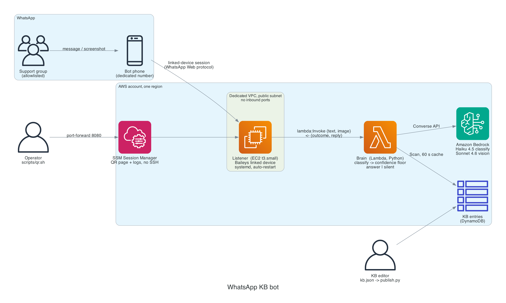
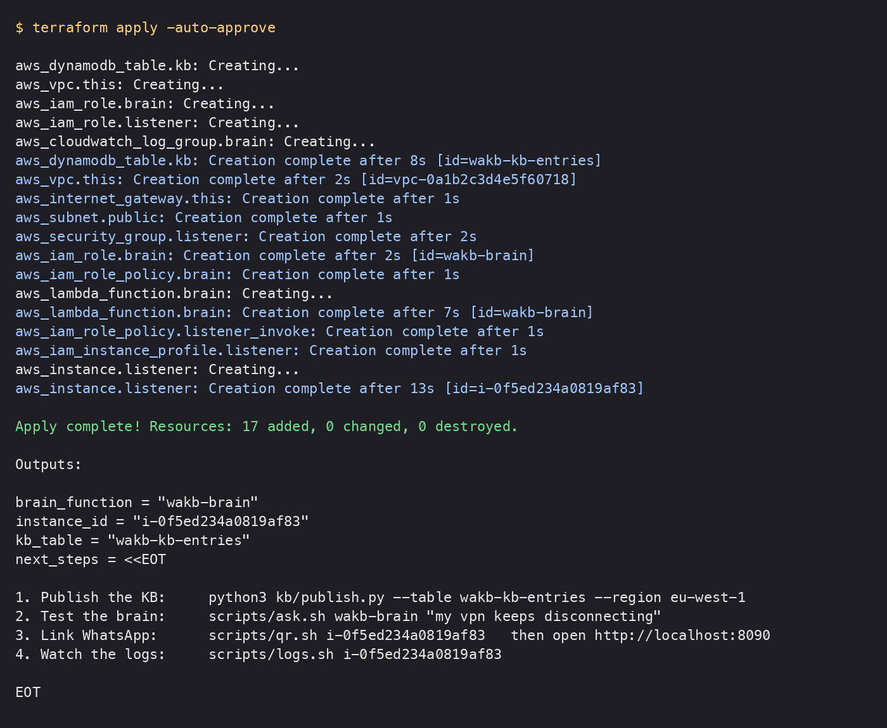
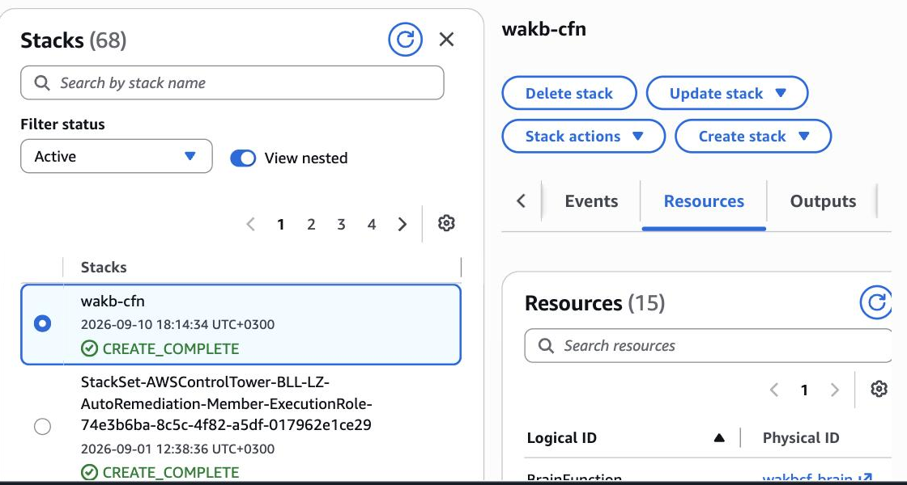
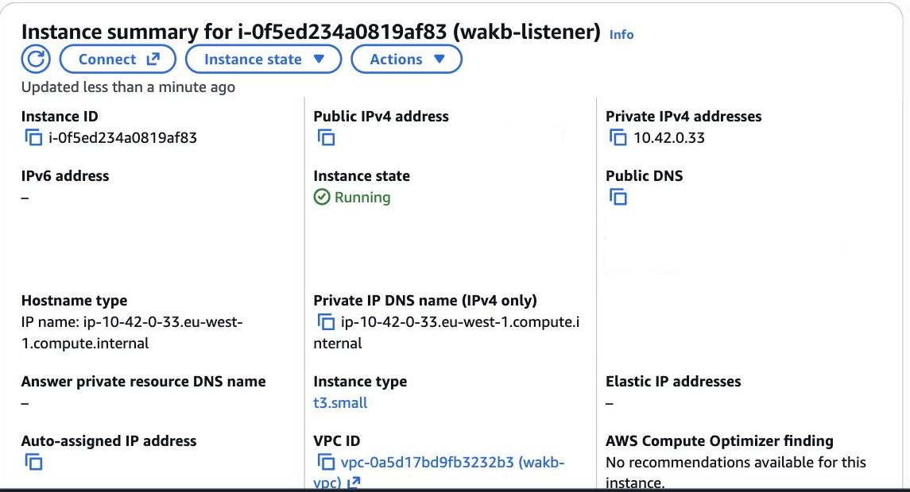
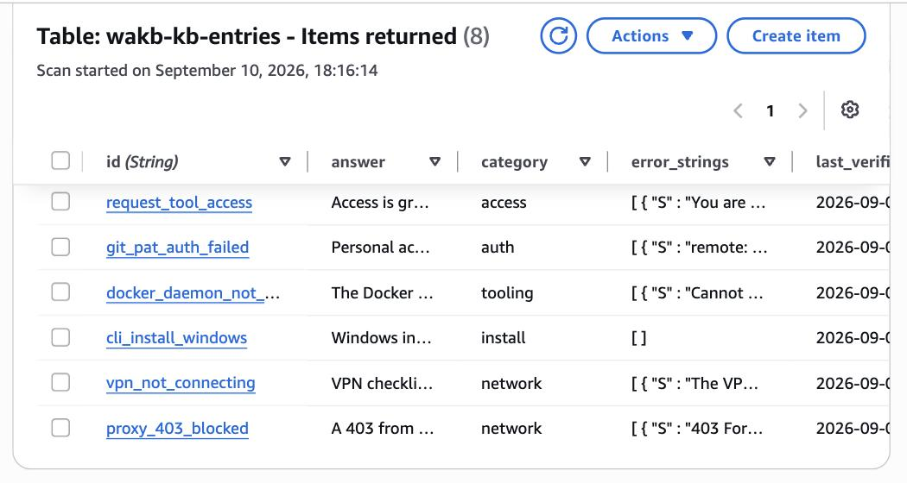
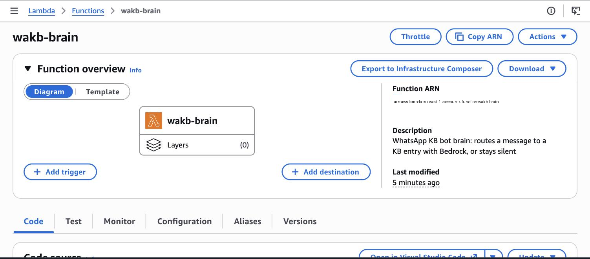
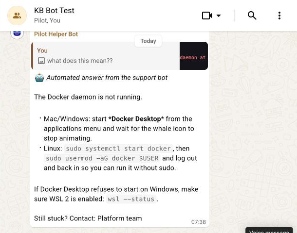

# I built a WhatsApp bot that answers my team's repeat questions from a knowledge base. Here is the architecture, the cost, and the repo.

*EC2 + Lambda + Amazon Bedrock, about $18 a month, Terraform or CloudFormation, deployed and tested live while writing. Plus the design rules that kept it from embarrassing me in front of 120 developers.*



**TL;DR** A small EC2 holds the WhatsApp session (Baileys). A Lambda asks Claude Haiku on Bedrock *which* human-written answer fits, and sends it verbatim if confidence clears a floor, otherwise says nothing. Knowledge base is a JSON file synced to DynamoDB. About $18/month. Terraform or CloudFormation, one `apply`. Tested live: nine messages, nine correct outcomes, screenshots included. Repo: [github.com/kobyal/whatsapp-kb-bot](https://github.com/kobyal/whatsapp-kb-bot). Use a dedicated number, never your own.

*Personal project, my own time and my own AWS account. Not a product of my employer and not endorsed by WhatsApp. It uses an unofficial WhatsApp client; section 1 explains what that means before you decide.*

---

Every support group has the same twenty questions. "The VPN keeps disconnecting." "How do I install this on Windows?" "I get AADSTS70043 again." Someone who knows the answer types it out for the fifteenth time, or pastes a link nobody reads, or is asleep.

I run one of those groups: about 120 developers at a bank onboarding onto a new AI coding tool, all in one WhatsApp group. In the summer of 2026 I built a bot that sits in the group and answers the questions that repeat. It has been running since, and it changed how I think about "RAG bots" for support.

This article is the template version of that bot. Everything here is in a public repo, [github.com/kobyal/whatsapp-kb-bot](https://github.com/kobyal/whatsapp-kb-bot), with both Terraform and CloudFormation, and I deployed it fresh into a clean AWS account while writing this to make sure the instructions are honest.

I will cover:

1. The two constraints that decide the architecture before you write a line
2. What is in the box, and why it is this small
3. Deploying it, step by step, with screenshots
4. The design rules that matter more than the code
5. Costs, risks, and what else is out there

## 1. Two constraints you cannot design around

### WhatsApp has no official way into a group

The first thing everyone reaches for is the WhatsApp Business Cloud API. It is the compliant route, and if your bot is a 1:1 customer-service line, use it.

But if your bot needs to live *inside a group that already exists*, read Meta's Groups API documentation carefully. As of writing, a group created through the API has a maximum of **8 participants**, the business has to create the group itself, and it cannot join a group a person created. Also, registering a phone number with the Cloud API deletes that number's normal WhatsApp account.

So for a community group of a hundred people, the only technical route is an **unofficial multi-device client**: a library that speaks the WhatsApp Web protocol and shows up as a "linked device" on a phone, exactly like WhatsApp Desktop does. I use [Baileys](https://github.com/WhiskeySockets/Baileys). It works very well. It is also against WhatsApp's terms of service, and numbers running it do get banned.

I am not going to pretend otherwise, so here is how I live with it:

- **Dedicated prepaid SIM.** Never your own number. If it gets banned, you lose a €5 SIM.
- **Reply-only, low volume.** The bot never starts a conversation and never messages strangers. It replies, in a group of people who know it is there, a few times a day.
- **Human pacing.** A random 1.5 to 4 second delay before every reply. Fixed machine cadence is one of the signals anti-automation systems key on.

If that risk profile is not acceptable for you, jump to section 5: the *brain* half of this template works unchanged behind the official API, and I list the compliant options there.

### Get the bot its own number. Not yours. Really.

This deserves its own heading because it is the mistake people make once.

The bot runs as a linked device of *some* WhatsApp account. If that account is yours, then a ban is a ban on **you**: your chats, your groups, your family, gone, with no appeal process that works. It also means every message the bot handles is visible to a session logged in as you, and every group you are in is a group the bot can technically see.

So:

- **A dedicated number**, on a **dedicated cheap phone** (any old Android works; it only needs to be online once every two weeks to keep the linked device alive).
- **A prepaid SIM with no monthly commitment.** The number must not expire, because if the SIM dies, the number gets recycled and someone else's WhatsApp eventually inherits your bot's identity. See the SIM notes below for what that looks like in Israel.
- **Not a virtual or VoIP number.** WhatsApp rejects most of them at registration and bans the rest later.
- **Do not attach anything you care about to that number**: no bank, no 2FA, no Google recovery.

SIM_SECTION_PLACEHOLDER

### A linked device is a socket, so Lambda cannot be the bot

The second constraint is architectural. A linked device holds a persistent, authenticated WebSocket. Lambda is stateless and dies after 15 minutes. Every serverless-only design for this I sketched died on that fact.

So the bot is two pieces:

- **The listener**: a tiny always-on EC2 instance holding the WhatsApp session. It knows nothing about the knowledge base. It forwards messages and sends replies.
- **The brain**: a Lambda function. It knows nothing about WhatsApp. JSON in, JSON out.

That split is not just forced; it is good. The brain is stateless, versioned, and redeployable in seconds. And the day someone says "can we have this in Teams too", you replace the listener and touch nothing else.

## 2. What is in the box

The whole repo is a few hundred lines of real code. Here is the tour.

```
whatsapp-kb-bot/
├── kb/            kb.json (the knowledge base), kbcheck.py, publish.py
├── brain/         lambda_function.py            ~200 lines of Python
├── listener/      listener.js, qrserve.js, install.sh, systemd units
├── infra/
│   ├── terraform/       VPC, EC2, Lambda, DynamoDB, IAM
│   └── cloudformation/  the same stack as one template + deploy.sh
├── scripts/       ask.sh, qr.sh, logs.sh, shell.sh   (all over SSM, no SSH)
└── docs/          this article, diagrams, design notes, a survey of alternatives
```

### The knowledge base is a JSON file

```json
{
  "id": "sso_session_expires_every_4h",
  "category": "auth",
  "status": "published",
  "triggers": ["logged out every few hours", "token expired", "sso keeps asking me to log in"],
  "error_strings": ["AADSTS70043", "The refresh token has expired due to inactivity"],
  "answer": "This is expected: the company's Conditional Access policy limits ...",
  "owner": "Platform team",
  "last_verified": "2026-09-01"
}
```

Three fields do the work. `triggers` are how people actually phrase the problem. `error_strings` are what they literally see on screen, which turns out to be the strongest signal there is: people describe problems inconsistently but quote errors verbatim. `answer` is what the bot sends. Exactly. Word for word.

`publish.py` syncs the file to a DynamoDB table. The brain reads the table with a 60-second cache, so an edit is live in the group within a minute with no redeploy. The file is also baked into the Lambda zip as a fallback snapshot, so the bot keeps answering if the table is unreachable.

### The brain: classify, then decide

Here is the entire decision, stripped of error handling:

```python
def lambda_handler(event, context):
    text = event["text"]
    if event.get("image_b64"):                       # a screenshot? read it into text first
        text += "\n" + read_image(event["image_b64"], event["mime"])

    entries, _ = load_entries()                      # DynamoDB, 60 s cache, kb.json fallback
    entry, confidence, why = classify(text, entries) # one Bedrock call, returns an id + 0..1

    if entry is None or confidence < MIN_CONFIDENCE:
        return {"outcome": "silent", ...}
    return {"outcome": "answer", "id": entry["id"], "reply": compose(entry, text)}
```

The classifier is Claude Haiku 4.5 through the Bedrock Converse API. It does not see the answers. It sees a **catalogue**: every entry's id, phrasings, error strings and a 140-character gloss. It returns `{"id": "...", "confidence": 0.93, "why": "..."}`, and that is all the model contributes.

Two things about that prompt earned their place through pain:

**It asks "is this a request for help at all?" first.** When I replayed 326 real group messages through an early version, half of the false positives were never questions. Someone posting a fix for others. A staff announcement that something now works. "Same here." The bot was talking over the humans doing triage. One paragraph in the prompt fixed most of it.

**The catalogue goes at the end of the system prompt, with nothing per-request before it.** That makes the whole prefix cacheable. Bedrock prompt caching kicks in once the prefix crosses the model's minimum (a few thousand tokens, so roughly 25+ entries), and at that point it cut my per-message cost by two thirds.

### The model routes. It does not write.

This is the rule I would defend hardest.

By default (`ANSWER_MODE=verbatim`), the bot sends the entry's `answer` text exactly as a human wrote and verified it. The model's only job is to pick *which* entry. There is no step where a language model composes prose that 120 people will read as authoritative.

Why so strict? Because in a group, a confident wrong answer is the most expensive thing the bot can do. Everyone reads it. It looks official. Someone follows it. Bounding the model to "pick an entry" bounds the failure to "wrong entry", and the confidence floor handles that. "Plausible invented steps" is simply not a failure mode anymore.

There is a `compose` mode for teams that want natural phrasing. It lets the model rephrase the one matched entry for the question, with the entry as its only allowed source. I ship it because people ask. I run `verbatim`.

### The listener: hold the session, forward, reply

`listener.js` is 150 lines of Node. It:

1. Opens a Baileys socket with credentials stored on disk. If there are none, it emits a QR code.
2. On every message: drop it unless the group is on the **allowlist** (by name or jid). Drop it if the bot sent it. Drop it if it predates startup.
3. Download the image if there is one, call the Lambda with `{text, image_b64, sender}`.
4. If the brain returned a `reply`, wait 1.5 to 4 seconds, then send it **as a quoted reply** to the original message, because that is how the humans in the group attach answers to questions.

The allowlist fails closed. An empty list answers nobody. This matters more than it sounds: my bot's phone is in the real 120-person group *and* in a test group, and for weeks it only answered in the test group while I measured it.

### The QR page nobody tells you about

Linking a device means scanning a QR code. The code **rotates every 20 to 60 seconds** depending on the library version. The first time I tried "save the QR to a PNG and send it to the person with the phone", seven codes had expired by the time they opened the image.

So `qrserve.js` is a page that re-renders the current code every 4 seconds. It binds to `127.0.0.1` on the instance and you reach it through an SSM port-forward. Never expose a linking QR publicly: anyone who scans it links the bot account to *their* phone.

## 3. Deploying it

I did this into a fresh sandbox account in `eu-west-1` while writing. Total time from `terraform apply` to a working brain: about four minutes. Linking the phone: one minute more.

### Prerequisites

- An AWS account with **Bedrock model access** enabled for Claude Haiku 4.5 (and Claude Sonnet 4.6 if you want screenshots read) in your region. This is a checkbox in the Bedrock console under *Model access*; forget it and every classification fails silently to "no answer".
- Terraform ≥ 1.5 **or** just the AWS CLI for the CloudFormation route.
- The AWS CLI with the [Session Manager plugin](https://docs.aws.amazon.com/systems-manager/latest/userguide/session-manager-working-with-install-plugin.html), for the QR page and logs.
- A dedicated phone number on a phone with WhatsApp installed.

### Step 1: fork and configure

The EC2 instance clones the repo at boot to get the listener code, so fork first and point the infra at your fork.

```bash
git clone https://github.com/<you>/whatsapp-kb-bot.git && cd whatsapp-kb-bot
cd infra/terraform && cp terraform.tfvars.example terraform.tfvars
```

```hcl
aws_region     = "eu-west-1"
name_prefix    = "wakb"
allowed_groups = ["KB Bot Test"]        # the group's name as you see it in WhatsApp
repo_url       = "https://github.com/<you>/whatsapp-kb-bot.git"
```

### Step 2: apply

```bash
terraform init && terraform apply
```

What gets created: a tiny dedicated VPC with one public subnet and **no inbound rules at all**, a `t3.small` with an IAM role that can do exactly two things (SSM, and invoke one Lambda), the Lambda with a role that can call Bedrock and scan one DynamoDB table, and the table.



The CloudFormation route is one script, because Lambda code over 4 KB has to come from S3:

```bash
aws s3 mb s3://<your-deploy-bucket>
infra/cloudformation/deploy.sh wakb <your-deploy-bucket> \
  AllowedGroups="KB Bot Test" RepoUrl=https://github.com/<you>/whatsapp-kb-bot.git
```



**What the test deploy caught.** I said I deployed this fresh while writing, and it paid for itself twice. On Amazon Linux 2023 the `nodejs20` package wires `/usr/bin/node` through the alternatives system, and my installer helpfully overwrote that link with a symlink to itself. And on first boot the OS runs its own package transaction for a minute, so a plain `dnf install` can lose the rpm lock and die. Both are fixed in the repo: no hand-made symlink, and a retry loop around the installer. The instance now comes up clean from user-data on the first try, with one retry logged.



### Step 3: publish the knowledge base

```bash
python3 kb/kbcheck.py                              # 8 entries, 0 errors, 0 warnings
python3 kb/publish.py --table wakb-kb-entries      # put x8
```



### Step 4: test the brain before WhatsApp is anywhere near it

This is the step that saves you an hour. The brain is a Lambda; call it.

```bash
scripts/ask.sh wakb-brain "getting AADSTS70043 again, third time today"
```

```json
{
  "outcome": "answer",
  "id": "sso_session_expires_every_4h",
  "score": 0.95,
  "reply": "🤖 _Automated answer from the support bot_\n\nThis is expected: ...",
  "note": "kb dynamodb:8 (8 published); classify sso_session_expires_every_4h 0.95 (EXACT ERROR SEEN ON SCREEN match: AADSTS70043); tokens in=1157 cached=0"
}
```

And the case that matters more, a message that is *not* a question:

```bash
scripts/ask.sh wakb-brain "FYI everyone: the proxy issue is fixed, thanks network team"
```

```json
{
  "outcome": "silent",
  "id": null,
  "note": "...; classify none 1.00 (Announcement/thanks, not a request for help); ..."
}
```

The `note` field is your debugging window. It tells you where the KB came from, what the classifier picked, how confident it was, and why. When the bot does something odd in the group, this is the first thing to read.



### Step 5: link the phone

```bash
scripts/qr.sh <instance-id>          # port-forwards 8080 on the box to localhost:8090
```

Open http://localhost:8090. On the bot's phone: WhatsApp → Linked devices → Link a device. Scan.


*The code is pixelated on purpose: a live linking QR is a credential.*

You will see `connection closed (code=515)` in the log right after pairing. That is normal: Baileys asks for a restart after the first link, and systemd restarts it in five seconds. Then:

```
[2026-09-10T16:42:11.803Z] READY as 9725XXXXXXXX; allowlist=["KB Bot Test"] dms=false
```

### Step 6: ask it something

I made a private group with just me and the bot and threw nine messages at it: two paraphrased questions, one exact error string, one Hebrew question against an English KB, a screenshot of a terminal error with a vague caption, and four that should get silence (an off-KB question, a thank-you, an announcement, and a "docker is slow" that mentions a KB topic but is a different problem). Nine for nine.



```
[04:32:54] IN  <sender>: my vpn keeps disconnecting every 10 minutes since this morning, anyone else?
[04:32:56] BRAIN answer id=vpn_not_connecting score=0.85 | kb dynamodb:8 (8 published); classify vpn_not_connecting 0.85 (VPN disconnection issue matches typical phrasing)
[04:32:59] OUT vpn_not_connecting (459 chars)
[04:33:40] IN  <sender>: how do I connect the CLI to our Snowflake warehouse?
[04:33:41] BRAIN silent id=null score=0 | classify none 0.95 (Question about Snowflake integration not in knowledge base)
[04:38:06] IN  <sender>: what does this mean?? [+image]
[04:38:20] BRAIN answer id=docker_daemon_not_running score=0.99 | vision: "I ran `docker ps` and got the error 'Cannot connect to the Docker daemon at unix:///var/run/docker.sock…'"
[04:38:23] OUT docker_daemon_not_running (454 chars)
```

Notice the first one: 0.85, exactly on the floor. The sample KB has four phrasings per entry; a real KB with twenty gets paraphrases into the 0.9s. Notice also the third: the screenshot had a useless caption, and the vision pass turned the pixels into the exact error string the KB keys on. The full nine-case table is in [docs/TESTING.md](../TESTING.md).

That is the whole loop.

## 4. The rules that matter more than the code

If you take nothing else from this, take these. Each one cost me something to learn.

**Silence beats a wrong answer.** My first floor was 0.80. When I replayed the full history and had an independent model grade every confident answer, the 0.85 confidence bucket was 92% wrong or partial. The floor sat five hundredths below the worst bucket and admitted all of it. Raising it to 0.90 and staying silent below cut the judged wrong-answer rate from 42% to 6%, and the bot answered fewer, better questions. The template ships at 0.85 as a starting point. Measure yours.

**Framing is part of the data.** A question about "how do I go back from X" returned nothing, although the entry holding the answer existed. The entry was titled and phrased as an "auth loop" problem. The classifier reads ids, triggers and the gloss; if those describe a different framing of the same fix, it will not match. Fixed by rewriting the triggers, not by touching the model.

**The KB decays silently.** The bot once gave a wrong current version number because an entry was two weeks stale. Nothing crashed. Nothing logged. It was just confidently wrong. Every entry has `last_verified` for this reason, and the "what is the current version" entry in the sample KB carries a note to editors saying exactly that.

**Messages sent while the listener is down are gone.** WhatsApp does not replay them to a linked device. Twice I debugged a "broken" feature that was really a message sent before the service came up. Check timestamps before believing the bot ignored something.

**Right-to-left is a formatting problem, not a language problem.** My group writes Hebrew with English technical terms. WhatsApp renders a mixed line left-to-right unless it starts with an invisible RTL mark, and the *last* line needs a mark of its own or it flips back. The brain detects Hebrew and does this automatically. If your language is LTR you will never notice the code is there.

## 5. Costs, risks, and the alternatives

### What it costs

| Item | Monthly |
|---|---|
| EC2 t3.small, 24/7 | ~$15 |
| 16 GB gp3 | ~$1.50 |
| Lambda, DynamoDB, CloudWatch | rounds to $0 at support-group volume |
| Bedrock Haiku 4.5, per message | about $0.002 to $0.007 (less with caching) |

Call it $18 a month plus a few cents a day.

**This does incur costs.** Before you `apply`, set an AWS Budget alert at, say, $30/month. If you enable `compose` mode or point the classifier at a bigger model, watch the Bedrock line; the KB catalogue is sent with every message and grows with the KB.

### What could go wrong

- **The number gets banned.** Covered in section 1. Dedicated SIM, reply-only, human pacing. It is a real risk and I will not quantify it, because nobody outside Meta can.
- **The phone goes offline for 14 days.** WhatsApp unlinks devices. The listener notices, clears its credentials, and shows a new QR. Keep the phone plugged in somewhere.
- **Bedrock model access is not enabled.** Every classify fails, the brain returns `silent` with the error in `note`, and the bot looks dead. Check `scripts/ask.sh` first.

### What else is out there

I surveyed the open-source landscape while writing this; the full table is in [docs/research/open-source-landscape.md](../research/open-source-landscape.md). The short version:

- **Transport**: Baileys (TypeScript) and whatsmeow (Go) are the two actively maintained protocol cores. Everything else wraps one of them. If you want an HTTP gateway instead of a library, look at **WAHA** or **GOWA**; avoid anything that needs Chromium on a small instance.
- **Turn-key platforms**: **n8n + WAHA** if non-developers should edit the flow, **Dify + Evolution API** if you want richer retrieval. Both have native Bedrock support. Flowise was archived in August 2026; Botpress open source is sunset; Typebot paywalls WhatsApp even when self-hosted.
- **Compliant 1:1**: the Meta Cloud API directly or via Twilio. Note that from 1 October 2026 Meta starts charging for service replies inside the 24-hour window, so an FAQ bot there is no longer free per answer.

### Why I still think a 500-line bot is the right size

Every platform above does more. None of them made my group's questions get answered more correctly, because the hard part was never the plumbing. It was the twenty-line knowledge base entry, its triggers, and the decision to say nothing when unsure. A small system you fully understand is easier to make careful than a large one you configure.

## Try it yourself

The repo is [github.com/kobyal/whatsapp-kb-bot](https://github.com/kobyal/whatsapp-kb-bot). Everything in this article is in it: the code, both infra flavours, the sample knowledge base, the test log, and the survey of alternatives.

1. Fork it. Replace `kb/kb.json` with your team's twenty questions.
2. `terraform apply` (or `deploy.sh` for CloudFormation), publish the KB, run `scripts/ask.sh` until the answers look right.
3. Get a dedicated SIM and an old phone. Scan the QR. Start in a private test group.
4. Tell me what broke. Issues and pull requests are open.

If you would rather not run an unofficial client, the brain works unchanged behind the official Cloud API for 1:1 support. Only the listener changes.

*Koby Almog leads developer tooling adoption at a bank in Israel and writes about making AI tools useful in regulated environments.*
